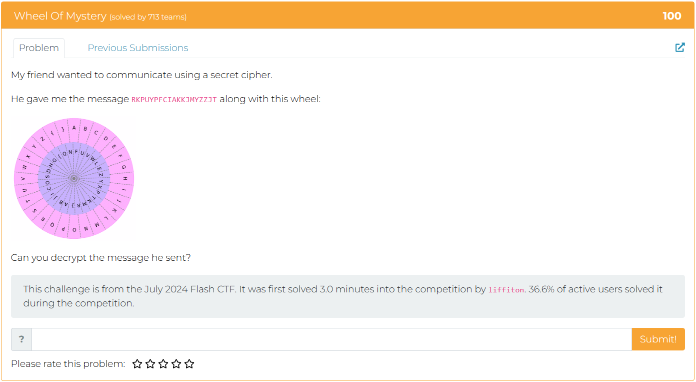

## Wheel Of Mystery - Writeup

---

### Challenge Description



---

### Understanding the Cipher

The challenge presents a cipher wheel composed of two concentric rings:

- The **outer wheel** is static and contains the characters `A-Z{}` in order.
- The **inner wheel** rotates, effectively changing the mapping between ciphertext and plaintext characters with each possible position.

This setup functions as a monoalphabetic substitution cipher, but with a twist: each rotation of the inner wheel generates a new substitution mapping. Therefore, the cipher can be solved by trying all possible rotations until the correct plaintext—starting with the known flag prefix `METACTF{`—is revealed.

---

### Decryption Approach

To decrypt the message, we simulate the rotation of the inner wheel and apply a character-by-character substitution:

1. **For each possible rotation** of the inner wheel:

   - Align the inner wheel to a new position by rotating it.
   - For every character in the ciphertext, find its index in the outer wheel and substitute it with the character at the same index in the current (rotated) inner wheel.

2. **Check if the resulting plaintext** begins with the known flag format `METACTF{`.
3. **Stop when a match is found**, and return the decrypted message as the flag.

This brute-force method is practical due to the small size of the character set (28 characters in total), and it ensures that the correct rotation is discovered efficiently.

---

### Python Solution

```python
from collections import deque

def decrypt(ciphertext, outer_wheel, inner_wheel):
    decrypted_text = ""
    for char in ciphertext:
        if char in outer_wheel:
            index = outer_wheel.index(char)
            decrypted_text += inner_wheel[index]
        else:
            decrypted_text += char
    return decrypted_text

def find_flag(ciphertext, outer_wheel, inner_wheel):
    for _ in range(len(outer_wheel)):
        decrypted_text = decrypt(ciphertext, outer_wheel, inner_wheel)
        if "METACTF{" in decrypted_text:
            return decrypted_text
        # Rotate the inner wheel for next attempt
        items = deque(inner_wheel)
        items.rotate(1)
        inner_wheel = ''.join(items)

# Cipher wheels
outer_wheel = "ABCDEFGHIJKLMNOPQRSTUVWXYZ{}"
inner_wheel = "QNFUVWLEZYXPTKMR}ABJICOSDHG{"

# Encrypted message
ciphertext = "RKPUYPFCIAKKJMYZZJT"

# Decrypt
print(find_flag(ciphertext, outer_wheel, inner_wheel))
```

---

### Solution

Running the script outputs:

```
METACTF{WHEELYCOOL}
```

---

### Conclusion

This challenge used a dynamic substitution cipher, where the **inner wheel rotates** with each decryption attempt. The flag was successfully revealed by simulating this rotation and testing for a known prefix.

**Flag:** `METACTF{WHEELYCOOL}`

---

Let me know if you want a version formatted for a PDF or a CTF platform submission.
